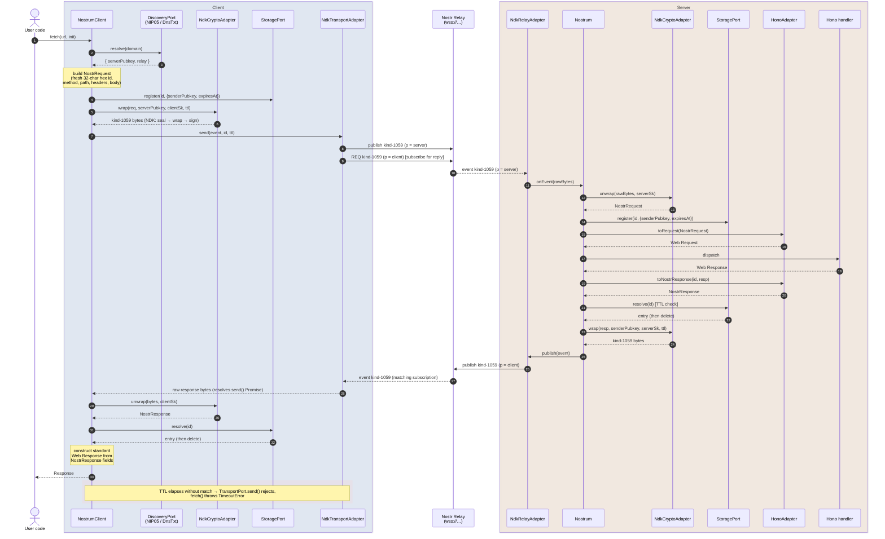

```mermaid
sequenceDiagram
    autonumber
    actor U as User code

    box rgba(200,220,255,0.3) Client
      participant NC as NostrumClient
      participant CD as DiscoveryPort<br/>(NIP05 / DnsTxt)
      participant CK as NdkCryptoAdapter
      participant CS as StoragePort
      participant CT as NdkTransportAdapter
    end

    participant R as Nostr Relay<br/>(wss://…)

    box rgba(255,225,200,0.3) Server
      participant SR as NdkRelayAdapter
      participant NS as Nostrum
      participant SK as NdkCryptoAdapter
      participant SS as StoragePort
      participant SH as HonoAdapter
      participant H as Hono handler
    end

    U->>NC: fetch(url, init)
    NC->>CD: resolve(domain)
    CD-->>NC: { serverPubkey, relay }
    Note over NC: build NostrRequest<br/>(fresh 32-char hex id,<br/>method, path, headers, body)

    NC->>CS: register(id, {senderPubkey, expiresAt})
    NC->>CK: wrap(req, serverPubkey, clientSk, ttl)
    CK-->>NC: kind-1059 bytes (NDK: seal → wrap → sign)
    NC->>CT: send(event, id, ttl)
    CT->>R: publish kind-1059 (p = server)
    CT->>R: REQ kind-1059 (p = client)  [subscribe for reply]

    R-->>SR: event kind-1059 (p = server)
    SR->>NS: onEvent(rawBytes)
    NS->>SK: unwrap(rawBytes, serverSk)
    SK-->>NS: NostrRequest
    NS->>SS: register(id, {senderPubkey, expiresAt})
    NS->>SH: toRequest(NostrRequest)
    SH-->>NS: Web Request
    NS->>H: dispatch
    H-->>NS: Web Response
    NS->>SH: toNostrResponse(id, resp)
    SH-->>NS: NostrResponse
    NS->>SS: resolve(id)  [TTL check]
    SS-->>NS: entry (then delete)
    NS->>SK: wrap(resp, senderPubkey, serverSk, ttl)
    SK-->>NS: kind-1059 bytes
    NS->>SR: publish(event)
    SR->>R: publish kind-1059 (p = client)

    R-->>CT: event kind-1059 (matching subscription)
    CT-->>NC: raw response bytes (resolves send() Promise)
    NC->>CK: unwrap(bytes, clientSk)
    CK-->>NC: NostrResponse
    NC->>CS: resolve(id)
    CS-->>NC: entry (then delete)
    Note over NC: construct standard<br/>Web Response from<br/>NostrResponse fields
    NC-->>U: Response

    rect rgba(255,200,200,0.2)
      Note over NC,CT: TTL elapses without match → TransportPort.send() rejects,<br/>fetch() throws TimeoutError
    end
```